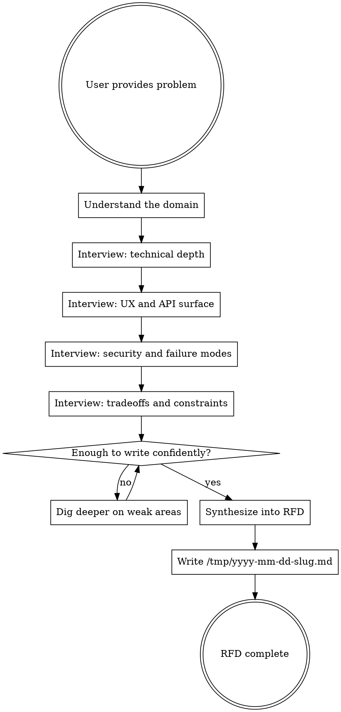

# Request For Decision (RFD)

## Overview

Produce a structured RFD document by deeply interviewing the user about a problem space, then synthesizing findings into a decision-ready document at `/tmp/yyyy-mm-dd-<slug>.md`.

## Process



## Interview Strategy

Use AskUserQuestion for every question. Ask one focused question at a time; never batch.

**Phase 1: Domain and context.** Why does this problem exist now? Who are the stakeholders? What prior art or existing systems touch this?

**Phase 2: Technical depth.** Data models, storage, consistency requirements, migration paths, performance characteristics, failure domains.

**Phase 3: UX and API surface.** Who calls this? What does the developer/user experience look like? Error states, edge cases in the interaction model.

**Phase 4: Security and failure modes.** Auth, authz, data sensitivity, blast radius of failure, rollback strategy, audit requirements.

**Phase 5: Tradeoffs and constraints.** Time, team size, operational burden, reversibility, what they are willing to sacrifice.

### Question Quality

Questions must be non-obvious. Avoid anything the user would answer with "obviously yes" or that restates what they already told you.

Good questions probe:
- Second-order consequences ("If X fails mid-operation, what state is Y left in?")
- Hidden assumptions ("You mentioned 'users'; is this internal-only or does it include API consumers?")
- Constraint tensions ("You want strong consistency but also low latency; which wins when they conflict?")
- Operational reality ("Who gets paged when this breaks at 3am? What do they need to diagnose it?")

Bad questions:
- "Should we use a database?" (obviously yes if data is involved)
- "Is security important?" (always yes)
- "Do you want it to be fast?" (always yes)

### When to stop interviewing

You have enough when you can confidently fill every section of the template without guessing. If you catch yourself about to write "TBD" or hedge with "likely", you need another question.

## Output Template

Write to `/tmp/yyyy-mm-dd-<slug>.md` where `<slug>` is a short kebab-case name derived from the problem.

```markdown
# RFD: <Title>

**Date:** yyyy-mm-dd
**Author:** <user>
**Status:** Draft

## Background

Why this decision matters. Problem context, prior art, what triggered this.

## Data Models

Entities, relationships, key fields, constraints, migration considerations.

## API

Endpoints or interfaces, request/response shapes, error codes, versioning.

## Security Considerations

Auth, authz, data classification, encryption, audit trail, blast radius.

## Open Questions

Anything unresolved after the interview. Be honest about gaps.

## References

Links to related docs, RFCs, prior RFDs, external resources mentioned.
```

## Skill Invocation

$ARGUMENTS

Interview me in detail using AskUserQuestion about literally anything: technical implementation, UI & UX, concerns, tradeoffs, etc. Make sure questions are not obvious. Go in-depth and continue interviewing me continually until you can write the RFD confidently. Then write the RFD to `/tmp/yyyy-mm-dd-<slug>.md`.
